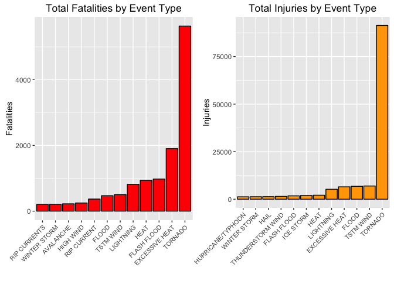
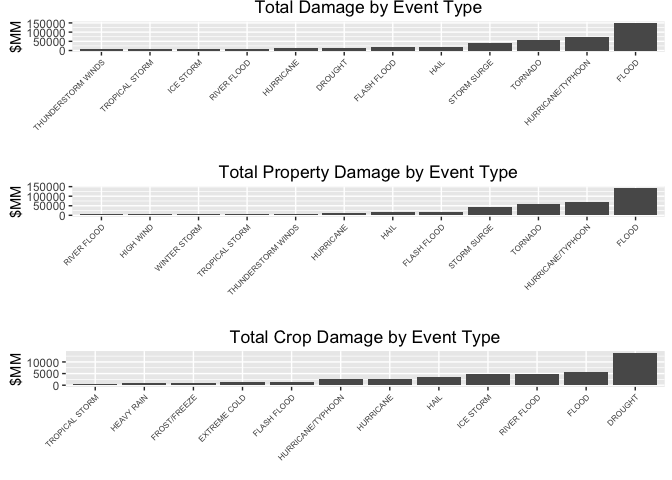

# Weather Events Impact Analysis
Jason R. Battles  
`r format(Sys.time(), '%d %B, %Y')`  


## Synopsis

Storms and other severe weather events can cause both public health and economic problems for communities and municipalities. Many severe events can result in fatalities, injuries, and property damage, and preventing such outcomes to the extent possible is a key concern.

This brief study involves exploring the U.S. National Oceanic and Atmospheric Administration's (NOAA) storm database. This database tracks characteristics of major storms and weather events in the United States, including when and where they occur, as well as estimates of any fatalities, injuries, and property damage.

The goal of this study is to explore the NOAA Storm Database and answer some questions about severe weather events and their impact on fatalities, injuries, and economy.

1. Across the United States, which types of events are most harmful with respect to population health?

2. Across the United States, which types of events have the greatest economic consequences?

This report may be considered by a government or municipal manager who might be responsible for preparing for severe weather events and will need to prioritize resources for different types of events.

### Prepare Environment
The analysis environment must be prepared with the appropriate libraries

```r
# install.packages("downloader")  ## Commented out to avoid installing agin if not necessary
library(downloader)
library(ggplot2)
library(grid)
```

## Data Processing

### Data Load
Download the compressed data file. Decompress the file and assign the results to a raw data frame (dataRaw).

```r
download(url="https://d396qusza40orc.cloudfront.net/repdata/data/StormData.csv.bz2", destfile="../data/StormData.csv.bz2")

## I like keeping my raw data files in a separate higher directory to avoid pushing large files to GitHub
dataRaw <- read.csv(bzfile("../data/StormData.csv.bz2"))
```

### Data Verification
There should be 902,297 observations across 37 variables if the raw data frame is correctly populated

```r
str(dataRaw)
```

```
## 'data.frame':	902297 obs. of  37 variables:
##  $ STATE__   : num  1 1 1 1 1 1 1 1 1 1 ...
##  $ BGN_DATE  : Factor w/ 16335 levels "1/1/1966 0:00:00",..: 6523 6523 4242 11116 2224 2224 2260 383 3980 3980 ...
##  $ BGN_TIME  : Factor w/ 3608 levels "00:00:00 AM",..: 272 287 2705 1683 2584 3186 242 1683 3186 3186 ...
##  $ TIME_ZONE : Factor w/ 22 levels "ADT","AKS","AST",..: 7 7 7 7 7 7 7 7 7 7 ...
##  $ COUNTY    : num  97 3 57 89 43 77 9 123 125 57 ...
##  $ COUNTYNAME: Factor w/ 29601 levels "","5NM E OF MACKINAC BRIDGE TO PRESQUE ISLE LT MI",..: 13513 1873 4598 10592 4372 10094 1973 23873 24418 4598 ...
##  $ STATE     : Factor w/ 72 levels "AK","AL","AM",..: 2 2 2 2 2 2 2 2 2 2 ...
##  $ EVTYPE    : Factor w/ 985 levels "   HIGH SURF ADVISORY",..: 834 834 834 834 834 834 834 834 834 834 ...
##  $ BGN_RANGE : num  0 0 0 0 0 0 0 0 0 0 ...
##  $ BGN_AZI   : Factor w/ 35 levels "","  N"," NW",..: 1 1 1 1 1 1 1 1 1 1 ...
##  $ BGN_LOCATI: Factor w/ 54429 levels ""," Christiansburg",..: 1 1 1 1 1 1 1 1 1 1 ...
##  $ END_DATE  : Factor w/ 6663 levels "","1/1/1993 0:00:00",..: 1 1 1 1 1 1 1 1 1 1 ...
##  $ END_TIME  : Factor w/ 3647 levels ""," 0900CST",..: 1 1 1 1 1 1 1 1 1 1 ...
##  $ COUNTY_END: num  0 0 0 0 0 0 0 0 0 0 ...
##  $ COUNTYENDN: logi  NA NA NA NA NA NA ...
##  $ END_RANGE : num  0 0 0 0 0 0 0 0 0 0 ...
##  $ END_AZI   : Factor w/ 24 levels "","E","ENE","ESE",..: 1 1 1 1 1 1 1 1 1 1 ...
##  $ END_LOCATI: Factor w/ 34506 levels ""," CANTON"," TULIA",..: 1 1 1 1 1 1 1 1 1 1 ...
##  $ LENGTH    : num  14 2 0.1 0 0 1.5 1.5 0 3.3 2.3 ...
##  $ WIDTH     : num  100 150 123 100 150 177 33 33 100 100 ...
##  $ F         : int  3 2 2 2 2 2 2 1 3 3 ...
##  $ MAG       : num  0 0 0 0 0 0 0 0 0 0 ...
##  $ FATALITIES: num  0 0 0 0 0 0 0 0 1 0 ...
##  $ INJURIES  : num  15 0 2 2 2 6 1 0 14 0 ...
##  $ PROPDMG   : num  25 2.5 25 2.5 2.5 2.5 2.5 2.5 25 25 ...
##  $ PROPDMGEXP: Factor w/ 19 levels "","-","?","+",..: 17 17 17 17 17 17 17 17 17 17 ...
##  $ CROPDMG   : num  0 0 0 0 0 0 0 0 0 0 ...
##  $ CROPDMGEXP: Factor w/ 9 levels "","?","0","2",..: 1 1 1 1 1 1 1 1 1 1 ...
##  $ WFO       : Factor w/ 542 levels ""," CI","%SD",..: 1 1 1 1 1 1 1 1 1 1 ...
##  $ STATEOFFIC: Factor w/ 250 levels "","ALABAMA, Central",..: 1 1 1 1 1 1 1 1 1 1 ...
##  $ ZONENAMES : Factor w/ 25112 levels "","                                                                                                                               "| __truncated__,..: 1 1 1 1 1 1 1 1 1 1 ...
##  $ LATITUDE  : num  3040 3042 3340 3458 3412 ...
##  $ LONGITUDE : num  8812 8755 8742 8626 8642 ...
##  $ LATITUDE_E: num  3051 0 0 0 0 ...
##  $ LONGITUDE_: num  8806 0 0 0 0 ...
##  $ REMARKS   : Factor w/ 436781 levels "","\t","\t\t",..: 1 1 1 1 1 1 1 1 1 1 ...
##  $ REFNUM    : num  1 2 3 4 5 6 7 8 9 10 ...
```

### Data Transformation
Now that the raw data is loaded into a raw data frame, subset the data to create a new data frame with a prioritized list of fatalities by event type.  The fatalities data frame is factored explicity to allow for ascending graph order later in the analysis.

```r
fatals <- aggregate(dataRaw$FATALITIES, by=list(dataRaw$EVTYPE), FUN=sum)
colnames(fatals) <- c("EventType", "Fatalities")
fatals <- fatals[with(fatals, order(-Fatalities)),]
mostfatal <- fatals[1:12,]

## Change the order of the factor levels by ordering them explicitly.  Allows ascending ggplot pgraph order. 
mostfatalordered <- mostfatal
mostfatalordered$EventType <- factor(mostfatalordered$EventType, levels = mostfatalordered$EventType[order(mostfatalordered$Fatalities)])
```

Now subset the data again to create a new data frame with a prioritized list of injuries by event type.  The injuries data frame is factored explicity to allow for ascending graph order later in the analysis.

```r
injuries <- aggregate(dataRaw$INJURIES, by=list(dataRaw$EVTYPE), FUN=sum)
colnames(injuries) <- c("EventType", "Injuries")
injuries <- injuries[with(injuries, order(-Injuries)),]
mostinjuries <- injuries[1:12,]

## Change the order of the factor levels by ordering them explicitly.  Allows ascending ggplot graph order. 
mostinjordered <- mostinjuries
mostinjordered$EventType <- factor(mostinjordered$EventType, levels = mostinjordered$EventType[order(mostinjordered$Injuries)])
```

Add more readable column headers, transform the observations to more readable numbers. Subset the damage data again to create new data frames with a prioritized list of Property Damage and Crop Damage by event type.  Economic values, some of which are in Billions (B) and Millions (M), and Thousands (K), are all converted to Millions


```r
damage <- dataRaw[, c("EVTYPE", "PROPDMG", "PROPDMGEXP", "CROPDMG", "CROPDMGEXP")]

damage$PropDamage <- damage$PROPDMG
## Convert Billions damage values to Millions
hasB_prop <- which(damage$PROPDMG > 0 & damage$PROPDMGEXP == "B")
for (i in hasB_prop) damage[i, "PropDamage"] <- damage[i, "PROPDMG"] * 1000
## Convert Thousands damage values to Millions
hasK_prop <- which(damage$PROPDMG > 0 & damage$PROPDMGEXP == "K")
for (i in hasK_prop) damage[i, "PropDamage"] <- damage[i, "PROPDMG"] / 1000

damage$CropDamage <- damage$CROPDMG
## Convert Billions damage values to Millions
hasB_crop <- which(damage$CROPDMG > 0 & damage$CROPDMGEXP == "B")
for (i in hasB_crop) damage[i, "CropDamage"] <- damage[i, "CROPDMG"] * 1000
## Convert Thousands damage values to Millions
hasK_crop <- which(damage$CROPDMG > 0 & damage$CROPDMGEXP == "K")
for (i in hasK_crop) damage[i, "CropDamage"] <- damage[i, "CROPDMG"] / 1000

propdamage <- aggregate(damage$PropDamage, by=list(damage$EVTYPE), FUN=sum)
cropdamage <- aggregate(damage$CropDamage, by=list(damage$EVTYPE), FUN=sum)

colnames(propdamage) <- c("EventType", "Damage")
colnames(cropdamage) <- c("EventType", "Damage")

propdamage <- propdamage[with(propdamage, order(-Damage)),]
cropdamage <- cropdamage[with(cropdamage, order(-Damage)),]

combined <- merge(propdamage, cropdamage, by="EventType", all.x=TRUE, all.y=TRUE)
combined <- transform(combined, TotalDamage = Damage.x + Damage.y)
colnames(combined) <- c("EventType", "Property", "Crop", "Total")
combined <- combined[with(combined, order(-Total, -Property, -Crop)),]

## Identify the Top 12 damaging events -- Total Damage, Property Damage, Crop Damage
mostdamage <- combined[1:12,]
mostpropdamage <- propdamage[1:12,]
mostcropdamage <- cropdamage[1:12,]

## Change the order of the factor levels by ordering them explicitly.  Allows ascending ggplot graph order. 
mostdamageOrd <- mostdamage
mostdamageOrd$EventType <- factor(mostdamageOrd$EventType, levels = mostdamageOrd$EventType[order(mostdamageOrd$Total)])

## Change the order of the factor levels by ordering them explicitly.  Allows ascending ggplot graph order. 
mostpropdamageOrd <- mostpropdamage
mostpropdamageOrd$EventType <- factor(mostpropdamageOrd$EventType, levels = mostpropdamageOrd$EventType[order(mostpropdamageOrd$Damage)])

## Change the order of the factor levels by ordering them explicitly.  Allows ascending ggplot graph order. 
mostcropdamageOrd <- mostcropdamage
mostcropdamageOrd$EventType <- factor(mostcropdamageOrd$EventType, levels = mostcropdamageOrd$EventType[order(mostcropdamageOrd$Damage)])
```


## Results

#### 1. Across the United States, which types of events are most harmful with respect to population health?

By a very wide margin, **Tornadoes** cause the most population fatalities and injuries for all weather events. In regards to Fatalaties, Excessive Heat was #2 and Flash Floods was #3.  

In regards to Injuries, after **Tornadoes**, Marine Straight-Line Winds (TSTM) was #2, and Floods was #3.


```r
# function for displaying any plot in the grid
vplayout <- function(x, y) viewport(layout.pos.row = x, layout.pos.col = y)

plot1 <- ggplot(mostfatalordered, aes(x = EventType, y = Fatalities)) + geom_bar(stat= "identity", fill = "red", col = "black") + theme(axis.text.x = element_text(size=8, angle=45, hjust=1)) + labs(title = "Total Fatalities by Event Type") + xlab("")
plot2 <- ggplot(mostinjordered, aes(x = EventType, y = Injuries)) + geom_bar(stat= "identity", fill = "orange", col = "black") + theme(axis.text.x = element_text(size=8, angle=45, hjust=1)) + labs(title = "Total Injuries by Event Type") + xlab("")

grid.newpage()
pushViewport(viewport(layout = grid.layout(1, 2)))
print(plot1, vp = vplayout(1, 1))
print(plot2, vp = vplayout(1, 2))
```

<!-- -->

Here are the values for the Top 12 fatality-causing weather types

```r
mostfatal
```

```
##          EventType Fatalities
## 834        TORNADO       5633
## 130 EXCESSIVE HEAT       1903
## 153    FLASH FLOOD        978
## 275           HEAT        937
## 464      LIGHTNING        816
## 856      TSTM WIND        504
## 170          FLOOD        470
## 585    RIP CURRENT        368
## 359      HIGH WIND        248
## 19       AVALANCHE        224
## 972   WINTER STORM        206
## 586   RIP CURRENTS        204
```

Here are the values for the Top 12 injury-causing weather types

```r
mostinjuries
```

```
##             EventType Injuries
## 834           TORNADO    91346
## 856         TSTM WIND     6957
## 170             FLOOD     6789
## 130    EXCESSIVE HEAT     6525
## 464         LIGHTNING     5230
## 275              HEAT     2100
## 427         ICE STORM     1975
## 153       FLASH FLOOD     1777
## 760 THUNDERSTORM WIND     1488
## 244              HAIL     1361
## 972      WINTER STORM     1321
## 411 HURRICANE/TYPHOON     1275
```


#### 2. Across the United States, which types of events have the greatest economic consequences?
**Floods** cause the most Total Damage.  **Floods** also cause the most in Total Property Damage.  However, **Droughts** cause the Most Crop Damage.

```r
plot3 <- ggplot(mostdamageOrd, aes(x=EventType, y=Total)) + geom_bar(stat= "identity") + theme(axis.text.x = element_text(size=6, angle=45, hjust=1)) + ylab("$MM") + labs(title = "Total Damage by Event Type") + xlab("")
plot4 <- ggplot(mostpropdamageOrd, aes(x=EventType, y=Damage)) + geom_bar(stat= "identity") + theme(axis.text.x = element_text(size=6, angle=45, hjust=1)) + ylab("$MM") + labs(title = "Total Property Damage by Event Type") + xlab("")
plot5 <- ggplot(mostcropdamageOrd, aes(x=EventType, y=Damage)) + geom_bar(stat= "identity") + theme(axis.text.x = element_text(size=6, angle=45, hjust=1)) + ylab("$MM") + labs(title = "Total Crop Damage by Event Type") + xlab("")

grid.newpage()
pushViewport(viewport(height=1.03, layout = grid.layout(3, 1)))
print(plot3, vp = vplayout(1, 1))
print(plot4, vp = vplayout(2, 1))
print(plot5, vp = vplayout(3, 1))
```

<!-- -->


Here are the dollar values in Millions for the Top 12 property-damaging weather types

```r
mostdamage
```

```
##              EventType   Property       Crop      Total
## 170              FLOOD 144664.710  5661.9685 150326.678
## 411  HURRICANE/TYPHOON  69305.840  2607.8728  71913.713
## 834            TORNADO  57235.860   574.9531  57810.814
## 670        STORM SURGE  43323.536     0.0050  43323.541
## 244               HAIL  16059.967  3465.5374  19525.504
## 153        FLASH FLOOD  16697.912  1421.3171  18119.229
## 95             DROUGHT   1046.106 13972.5660  15018.672
## 402          HURRICANE  11868.319  2741.9100  14610.229
## 590        RIVER FLOOD   5118.945  5029.4590  10148.405
## 427          ICE STORM   3994.928  5022.1135   9017.041
## 848     TROPICAL STORM   7703.891   678.3460   8382.237
## 786 THUNDERSTORM WINDS   7909.153   282.6507   8191.804
```

## Conclusions
Analysis of the NOAA Storm Database provided some interesting insights into which types of weather events pose major threats to the U.S. population and economy.  

1. From a Population Health perspective, we can conclude that increased attention on safety from **Tornadoes** would yield the greatest benefit in terms of reduced fatalities and injuries.  

2. From a purely Economic perspective, **Floods**, **Hurricanes** and **Droughts** have the largest impact of all the weather types.  
